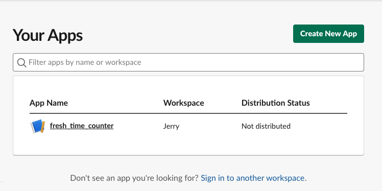
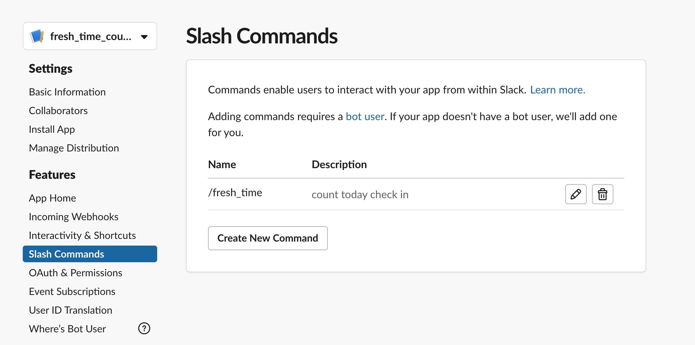
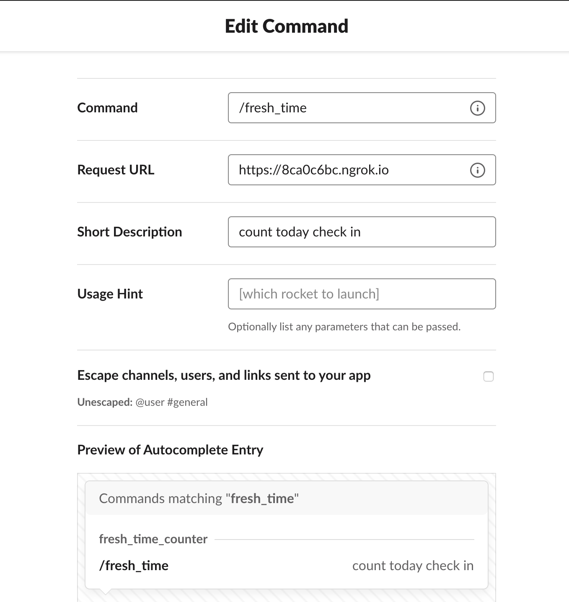
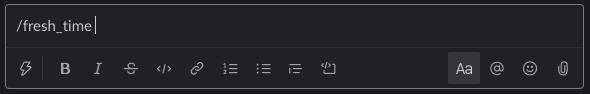
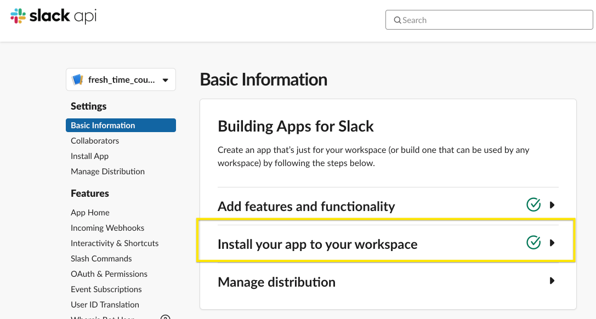

## Result

## usage

#### create new app

https://api.slack.com/apps

#### slash command

#### type `/fresh_time` in the channel you want to count

## slack api

#### fetch all users info in slack

https://api.slack.com/methods/users.list

#### fetch all message in channel

https://api.slack.com/methods/conversations.history

#### fetch all members in channel

https://api.slack.com/methods/conversations.members

## Refs

https://scotch.io/tutorials/create-a-custom-slack-slash-command-with-nodejs-and-express
